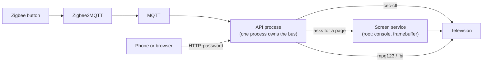

<!-- SPDX-License-Identifier: GPL-3.0-or-later -->
<!-- Copyright (C) 2026 Yann Bonsens -->

# How it works

The short version, for somebody about to read the code. [CLAUDE.md](../CLAUDE.md)
is the long one, with every decision that would otherwise look arbitrary and
the long list of things that were tried and did not work.



**One default state and three modes.** The box is in *television* by default:
the set shows its own programmes and the box's HDMI output is asleep. Three
modes take the screen one at a time — music, diagnostic, installation — and
every transition goes through one place, so the box is never half in two of
them.

The output sleeping whenever the box is idle is the whole trick. A television
that comes back on "the last input used" cannot come back on an input that is
silent when it wakes, so it falls back to its own programmes.

The MQTT subscriber runs **inside the API process** rather than as a separate
service, so one process owns the CEC bus and two simultaneous commands cannot
interleave their frames on it.

## Repository layout

| Directory | Contents |
|---|---|
| `api/` | FastAPI service: CEC control, music and photos, authentication, Zigbee bridge, system endpoints |
| `scripts/` | Installer, Zigbee setup helper, TV diagnostics and slideshow, host discovery, photo preparation |
| `systemd/` | Service units |
| `config/`, `polkit/`, `ssh/` | Configuration templates and hardening |
| `docs/` | Detailed procedures, the [FAQ](faq.md) and the [lessons](lessons.md) |
| `profiles/` | One television's measured CEC answers per file |

Everything specific to one installation lives outside the repository, in
`/etc/maman-tv-lite/`, `/var/lib/maman-tv-lite/` and `/etc/cloudflared/`: the
API password, the tunnel credentials, the button bindings and the television's
techniques. Pulling a new version of the code never touches them.

## Running the tests

```bash
cd api && python -m pytest -q                  # the fast layer, about six seconds
cd api && python -m pytest -q -m integration   # real binaries, about forty
```

The second layer executes the screen's own shell script and a fake `cec-ctl`
driven by a model television. It is excluded from the default run so the fast
loop stays fast, and CI runs both — run it yourself before committing anything
that touches the CEC transport or the screen.

## Measured on the box it was built for

A Raspberry Pi 1 Model B on the 32-bit image, a 4 GB card, a SONOFF ZBDongle-E
(which Zigbee2MQTT could not identify on its own: it needed the `ember` chipset
named, which the setup now finds by trying), two Tuya SH-SC07 buttons, a HIGH
ONE HI3231HD-EL television and a Samsung used for development.

- Boot to every service running: about four and a half minutes.
- Building Zigbee2MQTT from source: about twenty minutes.
- A full install with the buttons: 2.2 GB used on the card.
- Music and photos playing: about 13% of the single core.
